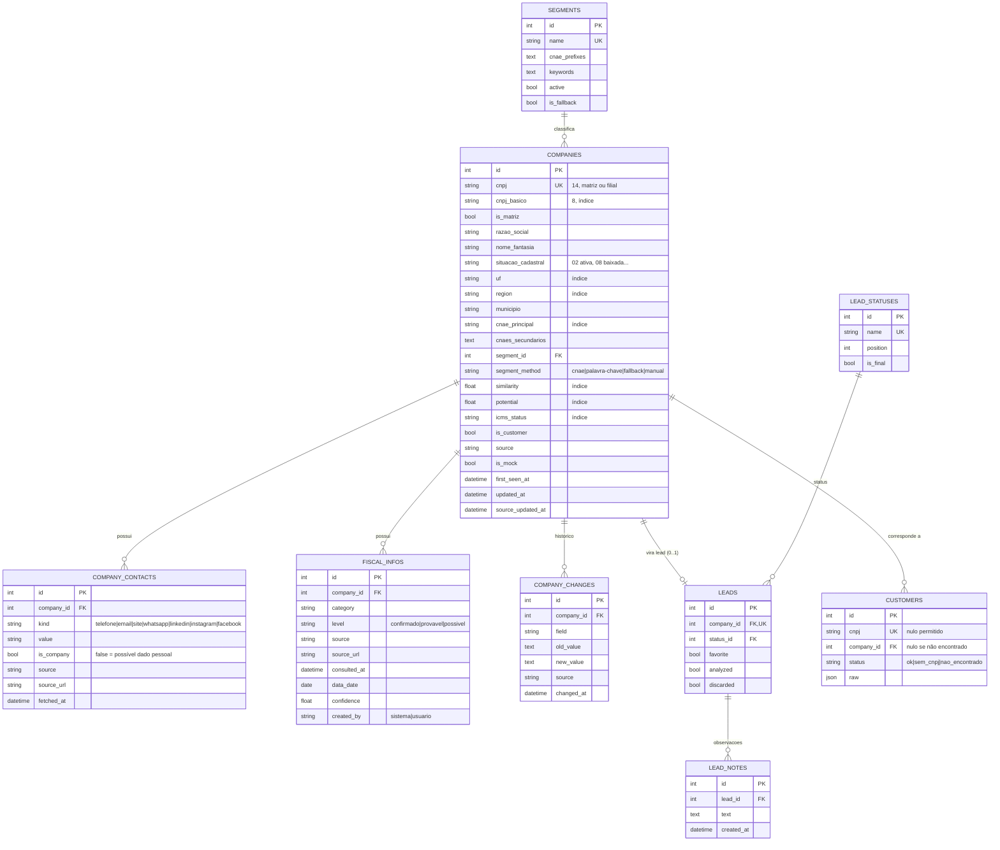

# 04 — Banco de dados (Fase 4)

PostgreSQL 16 em produção; SQLite em desenvolvimento/testes (mesmo modelo via SQLAlchemy).
Toda a suíte de testes é executada nos dois bancos.

## Decisões de modelagem

| Decisão | Motivo |
|---|---|
| **Company = estabelecimento** (CNPJ de 14 posições, `UNIQUE`) | a Receita publica dados por estabelecimento; matriz/filial têm endereço e contatos próprios. `cnpj_basico` (8) agrupa o grupo empresarial |
| Endereço e CNAEs secundários **na própria tabela** | relação 1:1 com o estabelecimento; CNAEs secundários em texto `"4321500,4742300"` pesquisável — evita tabelas e joins sem ganho real (prompt §23: "não criar tabelas sem necessidade") |
| Flags `has_phone/has_email/has_website` | filtros frequentes, indexados, recalculados a cada alteração de contato |
| `similarity`, `potential`, `completeness` materializados + `*_details` (JSON) | ordenação/paginação rápida no banco; detalhes explicam a nota |
| `search_text` normalizado (sem acento, minúsculo) | pesquisa por termos; índice **trigram** (`pg_trgm`) no PostgreSQL |
| `FiscalInfo` única para informações e benefícios | mesmos metadados de rastreabilidade (nível, fonte, URL, datas, confiança) |
| `Customer` separado de `Company` | a base de Paulo é privada e pode conter clientes sem CNPJ ou fora da base de empresas |
| Sem tabelas `Search`/`SearchFilter` | a busca é representada pela URL (pode ser salva no navegador); evitar funcionalidade sem uso comprovado |
| `Setting` chave/valor JSON | pesos, afinidades e perfil de cliente ideal editáveis sem migração |

## DER

Tabelas de apoio sem relacionamento: `users`, `data_sources` (monitoramento das fontes),
`jobs` (processos em background: status, total, processados, erros, log), `settings`,
`cnaes`, `municipios`, `naturezas_juridicas` (tabelas auxiliares oficiais da Receita).

## Cardinalidades

* Company 1:N CompanyContact, FiscalInfo, CompanyChange (`ON DELETE CASCADE`)
* Company 1:0..1 Lead (`leads.company_id UNIQUE`)
* Lead N:1 LeadStatus; Lead 1:N LeadNote
* Company N:1 Segment (`ON DELETE SET NULL`)
* Customer N:0..1 Company (`ON DELETE SET NULL`)

## Restrições e índices

* `companies.cnpj UNIQUE` — **deduplicação**: a mesma empresa vinda de fontes diferentes é atualizada, nunca duplicada.
* `company_contacts (company_id, kind, value) UNIQUE` — o mesmo contato não é repetido.
* `customers.cnpj UNIQUE` (vários nulos permitidos).
* Índices: CNPJ básico, UF, região, (UF, município), CNAE principal, (CNAE, UF), situação, porte,
  ICMS, flags de contato, similaridade, potencial, completude, (segmento, similaridade),
  `first_seen_at`, `updated_at`, e GIN trigram em `search_text` (PostgreSQL).

## Controle de atualização e rastreabilidade

| Campo | Significado |
|---|---|
| `first_seen_at` | quando a empresa entrou na base (define "novo lead") |
| `updated_at` | última alteração do registro no sistema |
| `source_updated_at` / `source_reference` | quando/qual referência da fonte (ex.: mês `2026-09` dos dados abertos) |
| `company_changes` | histórico campo a campo (situação, endereço, CNAE, porte, Simples…) |
| `enriched_at` | última verificação do site |
| `fiscal_infos.consulted_at` / `data_date` | data da consulta e data do dado na fonte |

## Evolução do esquema

A v1 cria o esquema com `metadata.create_all` (idempotente). Para alterações futuras de colunas em
produção, adotar Alembic (registrado como melhoria em `10-documentacao-final.md`).

## Volume

A base completa da Receita tem ~60 milhões de estabelecimentos. A importação é **filtrada** (CNAEs
dos clientes + segmentos, UFs opcionais, somente ativas), resultando tipicamente em centenas de
milhares a poucos milhões de linhas. Benchmark com 300 mil empresas em PostgreSQL: consultas de
busca entre 40 e 75 ms (ver `10-documentacao-final.md` §18).
